<p align="center">
  <picture>
    <source media="(prefers-color-scheme: dark)" srcset="assets/garden-dark.svg">
    
  </picture>
</p>

# solargraph

Mon graphe de contributions GitHub, transformé en jardin solarpunk isométrique. Une parcelle par jour, un bloc par année (5 par défaut, `GARDEN_YEARS` pour changer), une saison selon la date.

| Contributions du jour | Plante |
|---|---|
| 0 | terre nue |
| quartile 1 | pousse |
| quartile 2 | fleur (arbuste en hiver) |
| quartile 3 | arbre (sapin en hiver) |
| quartile 4 | éolienne et panneau solaire |

## Utilisation

```bash
python fetch.py   # récupère les contributions des N dernières années (GITHUB_TOKEN ou session `gh`)
python render.py  # écrit assets/garden-light.svg et assets/garden-dark.svg
```

Aucune dépendance, Python 3 suffit. `GITHUB_LOGIN` change le compte lu (par défaut `Shagshag`).

## Mise en ligne

Pousse ce dépôt sur `Shagshag/Shagshag` pour que le README s'affiche sur ton profil. La GitHub Action `.github/workflows/garden.yml` régénère le jardin chaque jour. Pour inclure les contributions privées, ajoute un secret `GH_STATS_TOKEN` (token avec `read:user`) et active « Private contributions » dans les réglages du profil.
